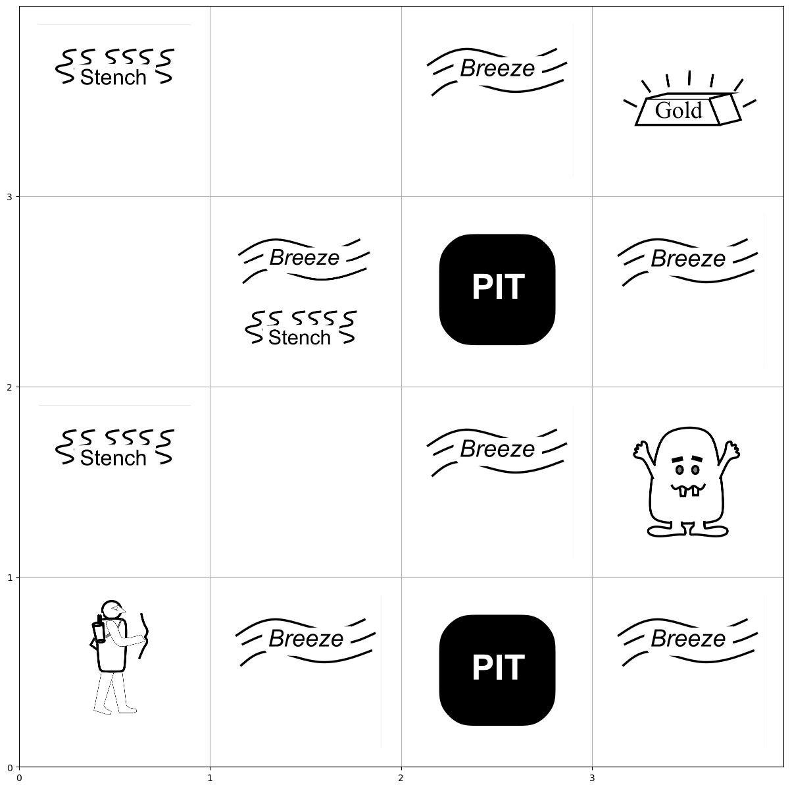

## Implementing Actor-Critic Algorithms with Multi-Agent Enviroment

### Environment Description

Number of Agents -> Wumpus, Explorer

Number of Spaces -> 16

Number of Actions -> 6 {Up, Down, Left, Right, Don't Move, Shoot Arrows}

Rewards for Agent -> +1 for moving close to goal state
                     -1 for moving away
                     +10 at goal state
                     +10 for killing wumpus
                     
Rewards for Wumpus -> +1 for moving close to explorer
                      -1 for moving away
                      +10 for killing the explorer

The Environmet resets to random positions so the agents learn better.

### Environment Image:

